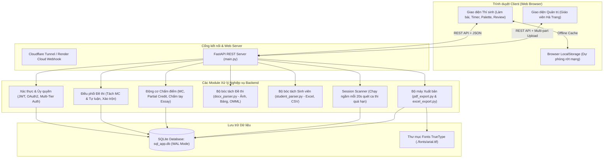

# KIẾN TRÚC HỆ THỐNG NỀN TẢNG THI TRỰC TUYẾN
**Hệ thống Thi Trắc nghiệm & Tự luận Trực tuyến Chuyên nghiệp**  
*Trường Đại học Công nghệ Kỹ thuật TP. Hồ Chí Minh (HCMUTE)*

---

## 1. Tổng quan Hệ thống (System Overview)
Hệ thống là một nền tảng thi trực tuyến chuyên dụng (Online Exam Platform) phục vụ các kỳ thi cuối kỳ, kiểm tra định kỳ của nhà trường. Hệ thống hỗ trợ thi trắc nghiệm (Single-choice & Multi-select) và tự luận (Essay), hỗ trợ bóc tách ngân hàng câu hỏi thông minh từ file Word (.docx) chứa hình ảnh và phương trình, phân phối đề ngẫu nhiên theo từng thí sinh, tự động chấm điểm trắc nghiệm kèm chấm điểm từng phần (Partial Credit), giao diện chấm bài tự luận cho giảng viên, và xuất hồ sơ lưu trữ dạng PDF/Excel (.zip).

---

## 2. Công nghệ Cốt lõi (Technology Stack)

| Thành phần | Công nghệ | Phiên bản / Thư viện chính | Ghi chú |
| :--- | :--- | :--- | :--- |
| **Backend** | Python (Asynchronous & Sync) | Python 3.12, FastAPI 0.141.1, Starlette, Uvicorn | Xây dựng RESTful API, async tasks |
| **Frontend** | Single Page Application (SPA) | Pure Vanilla JavaScript (ES6+), HTML5, CSS3 | Nhẹ, không phụ thuộc framework ngoài, tối ưu hiệu năng |
| **Database** | SQLite + SQLAlchemy ORM | SQLAlchemy 2.1.1, SQLite 3 (WAL mode) | `sql_app.db`, `NullPool`, `PRAGMA foreign_keys=ON` |
| **Docx Parser**| OpenXML / python-docx | `python-docx` 1.2.0, `lxml` 6.1.3 | Trích xuất text, hình ảnh inline/floating (Base64), công thức OMML |
| **Excel Parser/Export** | openpyxl & pandas | `openpyxl` 3.1.5, `pandas` 3.0.6, `xlrd` 2.0.2 | Nhập danh sách sinh viên; Xuất bảng điểm chi tiết |
| **PDF Engine** | ReportLab + Pillow | `reportlab` 5.0.1, `pillow` 12.3.0 | Xuất bài thi thí sinh, nhúng font TrueType Arial tiếng Việt |
| **Bảo mật / Auth** | JWT + Cryptographic Hash | `python-jose` 3.5.0, `passlib[bcrypt]` (bcrypt 4.0.1) | Chuẩn OAuth2 Password Bearer, HS256 |
| **Hosting Cloud**| Linux Ubuntu Container | Render Cloud Platform (Web Service) | Triển khai tự động qua GitHub webhook |
| **Tunnel Dev** | Cloudflare Tunnel | `cloudflared` (QUIC/HTTP2) | Đẩy cổng localhost:8000 ra Internet phục vụ test từ xa |

---

## 3. Sơ đồ Kiến trúc Tổng thể (Architecture Diagram)



---

## 4. Cấu trúc Thư mục và File trong Project

```text
online-exam-platform/
├── main.py                     # API router chính, cấu hình ứng dụng, auth, nghiệp vụ ca thi & kết quả
├── models.py                   # Mô hình cơ sở dữ liệu SQLAlchemy (User, Exam, Question, ExamResult)
├── database.py                 # Thiết lập kết nối SQLite, cấu hình WAL Mode, PRAGMA, NullPool
├── docx_parser.py              # Xử lý bóc tách file Word đề thi, trích xuất ảnh, công thức toán, bảng
├── student_parser.py           # Xử lý bóc tách danh sách thí sinh từ Excel/CSV/Docx
├── pdf_export.py               # Sinh file PDF bài thi thí sinh & đóng gói file ZIP (ReportLab)
├── excel_export.py             # Sinh bảng điểm Excel tổng hợp & bảng đối chiếu chi tiết (openpyxl)
├── static/
│   ├── index.html              # Frontend SPA (toàn bộ HTML, CSS, JavaScript cho Thí sinh & Quản trị)
│   ├── mau_ngan_hang_cau_hoi.docx # File mẫu ngân hàng câu hỏi
│   └── sample_students.xlsx    # File mẫu danh sách sinh viên
├── fonts/                      # Font TrueType Arial hỗ trợ hiển thị tiếng Việt trên Linux/Render
│   ├── arial.ttf
│   ├── arialbd.ttf
│   ├── ariali.ttf
│   └── arialbi.ttf
├── sql_app.db                  # File cơ sở dữ liệu SQLite
├── requirements.txt            # Danh sách thư viện Python phụ thuộc
├── Procfile                    # Cấu hình khởi chạy trên nền tảng đám mây (Render/Heroku)
└── test_*.py                   # 18 bộ test suites kiểm thử tự động toàn diện
```

---

## 5. Mô hình Dữ liệu (Database Schema)

Cơ sở dữ liệu gồm 4 bảng chính được kết nối chặt chẽ:

### 5.1. Bảng `users`
- `id` (Integer, Primary Key): ID tự tăng.
- `username` (String, Unique, Index): MSSV đối với sinh viên (ví dụ: `23150014`) hoặc email đối với admin (`trangnh@hcmute.edu.vn`).
- `password` (String): Mật khẩu được mã hóa Bcrypt hoặc plain-text dự phòng.
- `is_admin` (Boolean): Quyền quản trị viên (`True`: Admin, `False`: Thí sinh).
- `fullname` (String): Họ và tên thí sinh.
- `dob` (String, Nullable): Ngày tháng năm sinh (định dạng chuẩn `YYYY-MM-DD`).
- `class_name` (String, Nullable): Tên lớp học (ví dụ: `23150CLC`).
- `order_index` (Integer): Thứ tự hiển thị theo danh sách lớp.

### 5.2. Bảng `exams`
- `id` (Integer, Primary Key): ID kỳ thi.
- `title` (String): Tên kỳ thi (ví dụ: "Thi cuối kỳ 2026 - An toàn vệ sinh lao động").
- `code` (String): Mã kỳ thi (ví dụ: "ATVSLD2026").
- `description` (Text): Mô tả kỳ thi.
- `num_questions` (Integer): Số câu trắc nghiệm lấy vào đề thi của thí sinh.
- `duration_minutes` (Integer): Thời lượng làm bài (phút).
- `open_time` (DateTime): Thời điểm mở đề cho thí sinh vào thi.
- `close_time` (DateTime): Thời điểm kết thúc nhận bài.
- `is_active` (Boolean): Đang mở thi (chỉ 1 kỳ thi active tại một thời điểm).
- `is_archived` (Boolean): Đã lưu trữ (ẩn khỏi danh sách làm việc chính).
- `allow_review` (Boolean): Cho phép sinh viên xem lại đáp án sau khi ca thi đóng.
- `shuffle_questions` (Boolean): Xáo trộn ngẫu nhiên thứ tự câu hỏi trắc nghiệm.
- `shuffle_options` (Boolean): Xáo trộn ngẫu nhiên thứ tự đáp án A/B/C/D.
- `mc_max_score` (Float): Thang điểm tối đa cho phần Trắc nghiệm (mặc định: `7.0`).
- `essay_max_score` (Float): Thang điểm tối đa cho phần Tự luận (mặc định: `3.0`).

### 5.3. Bảng `questions`
- `id` (Integer, Primary Key): ID câu hỏi.
- `exam_id` (Integer, ForeignKey): Thuộc kỳ thi nào.
- `content` (Text): Nội dung câu hỏi (chứa thẻ HTML, nhúng ảnh `data:image/png;base64,...`).
- `option_a` .. `option_f` (Text): Nội dung các phương án lựa chọn (A đến F).
- `correct_option` (String): Đáp án đúng (ví dụ: `"A"`, `"B"`, hoặc `"A,C,E"` đối với multi-select).
- `explanation` (Text): Lời giải thích chi tiết.
- `question_type` (String): Phân loại câu hỏi (`multiple_choice`, `multi_select`, `essay`).
- `score_weight` (Float): Trọng số điểm thô của câu hỏi (mặc định `1.0` hoặc từ `(X điểm)`).
- `created_at` (DateTime): Thời điểm tạo.

### 5.4. Bảng `exam_results`
- `id` (Integer, Primary Key): ID bài thi đã tạo cho thí sinh.
- `exam_id` (Integer, ForeignKey): ID kỳ thi.
- `user_id` (Integer, ForeignKey): ID thí sinh.
- `score` (Float, Nullable): Điểm số chính thức theo thang điểm 10 (là `None` nếu đang chờ chấm tự luận).
- `max_score` (Float): Thang điểm tối đa chuẩn (`10.0`).
- `correct_count` (Integer): Số câu trả lời đúng hoàn toàn.
- `total_questions` (Integer): Tổng số câu hỏi trong đề của thí sinh đó.
- `answers` (Text): Chuỗi JSON lưu bài làm thô: `{"question_id": "đáp_án"}`.
- `answers_detail` (Text): Chuỗi JSON lưu bản chụp (snapshot) chi tiết toàn bộ câu hỏi, lựa chọn của sinh viên, đáp án đúng, điểm đạt được từng câu, phục vụ đối chiếu phúc khảo.
- `questions` (Text): Chuỗi JSON lưu danh sách ID câu hỏi được giao cho thí sinh theo đúng thứ tự.
- `start_time` (DateTime): Thời điểm bắt đầu làm bài.
- `submit_time` (DateTime): Thời điểm nộp bài.
- `duration_seconds` (Integer): Thời gian làm bài thực tế (giây).
- `status` (String): Trạng thái (`in_progress` - đang làm bài, `submitted` - đã nộp).
- `client_ip` (String): Địa chỉ IP của thí sinh khi làm bài.
- `user_agent` (String): Trình duyệt/thiết bị của thí sinh.
- Ràng buộc duy nhất: `UniqueConstraint('user_id', 'exam_id')` ngăn chặn việc tạo 2 bài thi cho cùng 1 sinh viên trong 1 kỳ thi.

---

## 6. Luồng Xác thực & Phân quyền (Auth & Security Flow)

1. **Đăng nhập (`POST /token`)**:
   - Nhận form OAuth2 (`username`, `password`).
   - Xử lý tiền tố MSSV (tự động bỏ tiền tố `sv` nếu thí sinh gõ `sv23150014`).
   - **Tầng sinh viên**: Kiểm tra MSSV trùng mật khẩu, hoặc ngày sinh (DOB) được chuẩn hóa theo nhiều định dạng (`DD/MM/YYYY`, `YYYY-MM-DD`, `DD-MM-YYYY`).
   - **Tầng quản trị**: Kiểm tra hash Bcrypt cryptographic.
   - Trả về JSON Web Token (JWT) có hiệu lực 240 phút.
2. **Ủy quyền (Role Enforcement)**:
   - Các API `/api/admin/*` yêu cầu quyền `is_admin == True`.
   - Các API `/api/exam/*` chỉ dành cho thí sinh (`is_admin == False`). Quản trị viên không thể tham gia làm bài thi để tránh sai lệch thống kê.

---

## 7. Động cơ Phân phối Đề thi & Chấm điểm (Exam & Scoring Engine)

1. **Phân phối đề thi (`GET /api/exam`)**:
   - Nếu thí sinh đã có phiên `in_progress`, hệ thống tải lại đúng đề và thứ tự câu hỏi cũ (chống gian lận bằng cách F5 đổi đề).
   - Đề thi được phân làm 2 phần rõ rệt:
     * **Phần 1 (Trắc nghiệm)**: Lấy số lượng theo `num_questions` cấu hình và xáo trộn ngẫu nhiên (nếu `shuffle_questions = True`).
     * **Phần 2 (Tự luận)**: Giữ nguyên 100% tất cả câu tự luận trong ngân hàng đề, cố định thứ tự ban đầu.
2. **Động cơ Chấm điểm (`calculate_exam_score`)**:
   - **Trắc nghiệm đơn (Single-Choice)**: Chọn đúng nhận trọn vẹn điểm trọng số câu, sai nhận 0 điểm.
   - **Trắc nghiệm nhiều đáp án (Multi-Select)**: Áp dụng công thức tính điểm từng phần (Partial Credit):
     $$\text{fraction} = \max\left(0.0, \frac{\text{Số đáp án đúng đã chọn} - \text{Số đáp án sai đã chọn}}{\text{Tổng số đáp án đúng của câu}}\right)$$
     $$\text{Điểm thô} = \text{fraction} \times \text{score\_weight}$$
   - **Tự luận (Essay)**:
     * Nếu bỏ trắng: Tự động tính 0.0 điểm.
     * Nếu có viết bài: Chuyển sang trạng thái `pending_grading` (Chờ chấm). Tổng điểm toàn bài giữ `None` cho tới khi giáo viên chấm bài.
   - **Quy đổi thang điểm 10**:
     $$\text{Điểm trắc nghiệm quy đổi} = \frac{\text{Điểm thô MC}}{\text{Tổng trọng số MC}} \times \text{mc\_max\_score (7.0)}$$
     $$\text{Điểm tự luận quy đổi} = \frac{\text{Điểm thô Essay}}{\text{Tổng trọng số Essay}} \times \text{essay\_max\_score (3.0)}$$
     $$\text{Điểm tổng kết} = \text{Điểm trắc nghiệm} + \text{Điểm tự luận} \quad (\text{Thang điểm 10.0})$$

---

## 8. Động cơ Xuất bản (Export Engine)

- **Xuất ZIP PDF bài thi (`/api/admin/results/export_pdf_zip`)**:
  - Dùng ReportLab tạo tài liệu chuẩn từng trang cho mỗi thí sinh (thông tin thí sinh, bảng điểm tổng quan, các câu hỏi kèm hình ảnh trực quan, đánh dấu đáp án đúng/sai, lời giải và điểm từng phần).
  - Tự động nhận diện font TrueType từ `./fonts/` để tránh lỗi vỡ font tiếng Việt trên môi trường Linux Render.
  - Nén toàn bộ file `.pdf` vào tệp ZIP gọn gàng ở thư mục gốc (không sinh file thừa `.txt` hay `.xlsx`).
- **Xuất ZIP Excel bảng điểm (`/api/admin/results/export`)**:
  - Tạo 1 file Excel bảng tổng hợp điểm cả lớp.
  - Tạo từng file Excel đối chiếu chi tiết bài làm cho từng thí sinh tham gia.
  - Đóng gói toàn bộ vào 1 file ZIP duy nhất.
